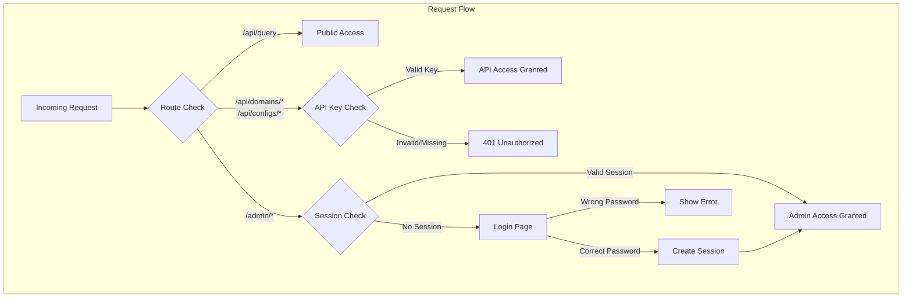

# Design Document: API Authentication

## Overview

This design describes a simple password-based authentication system for the Flask domain configuration service. The system uses two authentication mechanisms:

1. **Session-based authentication** for the admin web interface (`/admin/*`)
2. **API key authentication** for protected REST APIs (`/api/domains/*`, `/api/configs/*`)

The query API (`/api/query`) remains public and requires no authentication.

## Architecture



## Components and Interfaces

### 1. Authentication Module (`app/auth/`)

The authentication module provides decorators and utilities for protecting routes.

```python
# app/auth/__init__.py
from functools import wraps
from flask import session, redirect, url_for, request, jsonify, current_app

def require_api_key(f):
    """Decorator to require API key for API endpoints."""
    @wraps(f)
    def decorated(*args, **kwargs):
        api_key = request.headers.get('X-API-Key')
        expected_key = current_app.config.get('API_KEY')
        
        if not api_key or api_key != expected_key:
            return jsonify({'error': 'Unauthorized', 'message': '无效的 API 密钥'}), 401
        return f(*args, **kwargs)
    return decorated

def require_login(f):
    """Decorator to require login for admin routes."""
    @wraps(f)
    def decorated(*args, **kwargs):
        if not session.get('authenticated'):
            return redirect(url_for('auth.login', next=request.url))
        return f(*args, **kwargs)
    return decorated

def verify_password(password: str) -> bool:
    """Verify the provided password against configured admin password."""
    expected = current_app.config.get('ADMIN_PASSWORD')
    return password == expected
```

### 2. Auth Blueprint (`app/auth/routes.py`)

Handles login/logout for the admin web interface.

```python
# app/auth/routes.py
from flask import Blueprint, render_template, request, redirect, url_for, session, flash

auth_bp = Blueprint('auth', __name__)

@auth_bp.route('/login', methods=['GET', 'POST'])
def login():
    """Login page and handler."""
    if request.method == 'POST':
        password = request.form.get('password')
        if verify_password(password):
            session['authenticated'] = True
            session.permanent = True
            next_url = request.args.get('next', url_for('admin.index'))
            return redirect(next_url)
        flash('密码错误', 'error')
    return render_template('auth/login.html')

@auth_bp.route('/logout')
def logout():
    """Logout handler."""
    session.clear()
    return redirect(url_for('auth.login'))
```

### 3. Configuration Updates (`config.py`)

```python
# Additional configuration
class Config:
    # ... existing config ...
    
    # Authentication
    ADMIN_PASSWORD = os.environ.get('ADMIN_PASSWORD')
    API_KEY = os.environ.get('API_KEY')
    
    # Session timeout (default 24 hours)
    PERMANENT_SESSION_LIFETIME = timedelta(hours=int(os.environ.get('SESSION_TIMEOUT_HOURS', 24)))
```

### 4. Protected API Integration

The domain and config API namespaces will use the `require_api_key` decorator:

```python
# app/api/domains.py
from app.auth import require_api_key

@ns.route('')
class DomainList(Resource):
    @ns.doc('list_domains')
    @require_api_key
    def get(self):
        # ... existing implementation ...
```

### 5. Protected Admin Integration

Admin routes will use the `require_login` decorator:

```python
# app/admin/routes.py
from app.auth import require_login

@admin_bp.route('/domains')
@require_login
def domain_list():
    # ... existing implementation ...
```

## Data Models

No new database models are required. Authentication state is managed through:

1. **Flask Session**: Stores `authenticated` flag for web interface
2. **Environment Variables**: Stores `ADMIN_PASSWORD` and `API_KEY`

### Session Data Structure

```python
session = {
    'authenticated': bool,  # True if user has logged in
    '_permanent': bool      # True for persistent sessions
}
```

### Configuration Schema

| Variable | Required | Default | Description |
|----------|----------|---------|-------------|
| `ADMIN_PASSWORD` | Yes (prod) | `admin` (dev) | Password for admin login |
| `API_KEY` | Yes (prod) | `dev-api-key` (dev) | API key for protected endpoints |
| `SESSION_TIMEOUT_HOURS` | No | `24` | Session expiration in hours |


## Correctness Properties

*A property is a characteristic or behavior that should hold true across all valid executions of a system—essentially, a formal statement about what the system should do. Properties serve as the bridge between human-readable specifications and machine-verifiable correctness guarantees.*

Based on the prework analysis, the following properties have been identified:

### Property 1: Query Endpoint Always Accessible

*For any* request to the `/api/query` endpoint, regardless of whether authentication headers are present, absent, valid, or invalid, the Auth_System SHALL process the request and return a valid response (not 401/403).

**Validates: Requirements 1.1, 1.2**

### Property 2: Protected API Endpoints Require Valid API Key

*For any* request to `/api/domains/*` or `/api/configs/*` endpoints, the request SHALL return 401 Unauthorized if and only if the `X-API-Key` header is missing or contains an invalid value.

**Validates: Requirements 2.1, 2.2, 2.3, 2.4**

### Property 3: Admin Routes Require Valid Session

*For any* request to `/admin/*` routes (excluding `/auth/*`), the request SHALL redirect to the login page if and only if the session does not contain a valid `authenticated` flag.

**Validates: Requirements 3.1, 3.4**

### Property 4: Invalid Credentials Are Rejected

*For any* password submitted to the login endpoint that does not match the configured `ADMIN_PASSWORD`, the Auth_System SHALL not create an authenticated session and SHALL display an error.

**Validates: Requirements 3.3**

## Error Handling

### API Authentication Errors

| Scenario | HTTP Status | Response Body |
|----------|-------------|---------------|
| Missing API key | 401 | `{"error": "Unauthorized", "message": "缺少 API 密钥"}` |
| Invalid API key | 401 | `{"error": "Unauthorized", "message": "无效的 API 密钥"}` |

### Web Authentication Errors

| Scenario | Behavior |
|----------|----------|
| Unauthenticated access | Redirect to `/auth/login?next={original_url}` |
| Wrong password | Flash message "密码错误", stay on login page |
| Session expired | Redirect to login page |

### Configuration Errors

| Scenario | Behavior |
|----------|----------|
| Missing `ADMIN_PASSWORD` in production | Raise `ConfigurationError` on startup |
| Missing `API_KEY` in production | Raise `ConfigurationError` on startup |

## Testing Strategy

### Unit Tests

Unit tests will cover specific examples and edge cases:

1. **Login flow tests**: Correct password grants access, wrong password shows error
2. **Logout flow tests**: Session is cleared, redirect to login
3. **Configuration tests**: Environment variable loading, default values in dev mode
4. **Session expiration tests**: Expired sessions require re-authentication

### Property-Based Tests

Property-based tests will validate universal properties using `hypothesis` library:

1. **Property 1**: Generate random query parameters and auth headers, verify query always succeeds
2. **Property 2**: Generate random API keys, verify protected endpoints return 401 for invalid keys and success for valid keys
3. **Property 3**: Generate random admin routes, verify redirect behavior based on session state
4. **Property 4**: Generate random incorrect passwords, verify rejection

**Configuration**:
- Minimum 100 iterations per property test
- Each test tagged with: `Feature: api-authentication, Property N: {property_text}`

### Integration Tests

1. Full login → access admin → logout flow
2. API key authentication for CRUD operations
3. Query API accessibility without authentication
